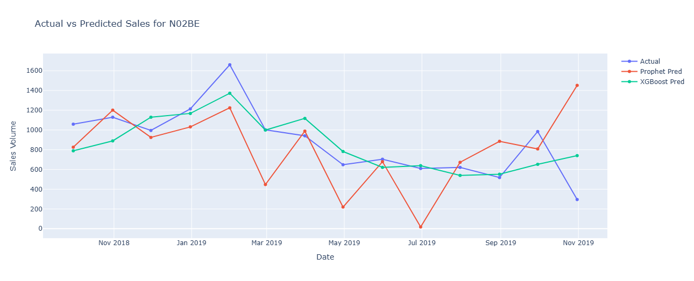

# 📊 Pharma Sales Forecasting: Time Series Analysis & Predictive Modeling


> **A comprehensive data science project for pharmaceutical sales forecasting using advanced machine learning techniques, featuring interactive dashboards and automated reporting.**

---

## 📑 Table of Contents
- [Project Overview](#-project-overview)
- [Interactive Dashboard](#-interactive-dashboard)
- [Business Problem](#-business-problem)
- [Key Features](#-key-features)
- [Dataset Description](#-dataset-description)
- [Methodology](#-methodology)
- [Results & Insights](#-results--insights)
- [Visualizations](#-visualizations)
- [Project Structure](#-project-structure)
- [Installation & Usage](#-installation--usage)
- [Technologies Used](#-technologies-used)
- [Future Improvements](#-future-improvements)

---

## 🎯 Project Overview

This project addresses a critical challenge in the pharmaceutical industry: **accurate sales forecasting across multiple drug categories**. By leveraging time series analysis and machine learning, I developed predictive models to support New Product Development (NPD) and strategic decision-making.

### **Key Objectives:**
✅ Forecast monthly pharmaceutical sales across 8 ATC drug categories  
✅ Compare baseline (Prophet) vs. advanced (XGBoost) models  
✅ Generate actionable insights for NPD strategy  
✅ Create interactive dashboards for stakeholder presentations  

---

## 🌐 Interactive Dashboard

### **[📊 View Live Dashboard →](https://htmlpreview.github.io/?https://github.com/Omneya21/Pharma-Sales-Forecasting/blob/main/sales_dashboard.html)**

<div align="center">
  <a href="https://htmlpreview.github.io/?https://github.com/Omneya21/Pharma-Sales-Forecasting/blob/main/sales_dashboard.html">
    
  </a>
  <p><em>Click image to view interactive dashboard with all 8 drug categories</em></p>
</div>

### **Dashboard Features:**
- 🔄 **Toggle between 8 drug categories** (M01AB, M01AE, N02BA, N02BE, N05B, N05C, R03, R06)
- 📊 **Compare Actual vs Prophet vs XGBoost predictions**
- 🎯 **Interactive hover tooltips** showing exact values
- 🔍 **Zoom and pan capabilities** for detailed analysis
- 📱 **Responsive design** works on mobile and desktop

---

## 💼 Business Problem

### **Challenge:**
Pharmaceutical companies need accurate sales forecasts to:
- Optimize inventory management
- Plan production schedules
- Identify high-growth product categories
- Support New Product Development decisions
- Allocate marketing resources effectively

### **Solution:**
Developed a **dual-model forecasting system** combining:
1. **Prophet** (Facebook's time series tool) - Baseline model
2. **XGBoost** with feature engineering - Advanced model

---

## ✨ Key Features

### 🔍 **Exploratory Data Analysis (EDA)**
- Comprehensive statistical analysis of 2,106+ daily sales records
- Temporal pattern identification (trends, seasonality)
- Missing value analysis and data quality checks
- Interactive visualizations with Plotly

### 🛠️ **Feature Engineering**
- **Lag Features**: Historical sales values (1-month lag)
- **Rolling Averages**: 3-month moving averages
- **Temporal Features**: Year, Month extraction
- **Category-Specific Features**: Per-drug engineered variables

### 🤖 **Advanced Modeling**
- **Baseline Model**: Prophet with yearly seasonality
- **Advanced Model**: XGBoost with Optuna hyperparameter tuning
- **Cross-Validation**: Time-based train-test split (80/20)
- **Evaluation Metrics**: MAE, RMSE for model comparison

---

## 📦 Dataset Description

### **Source:** 
Pharmaceutical Sales Data (Kaggle)

### **Scope:**
- **Period**: January 2014 - October 2019
- **Granularity**: Daily → Aggregated to Monthly
- **Records**: 2,106 daily entries → 70 monthly aggregates

### **ATC Drug Categories:**
| Category | Description | Avg Monthly Sales |
|----------|-------------|-------------------|
| **M01AB** | Anti-inflammatory (non-steroids) | 5.03 |
| **M01AE** | Propionic acid derivatives | 3.90 |
| **N02BA** | Salicylic acid derivatives | 3.88 |
| **N02BE** | Anilides (Pain relievers) | **29.92** ⭐ |
| **N05B** | Anxiolytics | 8.85 |
| **N05C** | Hypnotics and sedatives | 0.59 |
| **R03** | Anti-asthmatics | 5.51 |
| **R06** | Antihistamines | 2.90 |

> **Note**: N02BE (Pain relievers) shows highest sales volume - prime candidate for NPD focus.

---

## 🔬 Methodology

### **1. Data Preprocessing**
```python
# Date conversion & resampling to monthly frequency
df['datum'] = pd.to_datetime(df['datum'])
df_monthly = df.resample('ME').sum()

# Feature engineering
df['lag1'] = df['sales'].shift(1)
df['ma3'] = df['sales'].rolling(3).mean()
```

### **2. Model Development**

#### **Prophet Model (Baseline)**
- **Seasonality**: Yearly patterns enabled
- **Training**: 54 months of historical data
- **Forecasting**: 14-month test period
- **Best For**: Capturing trend + seasonality

#### **XGBoost Model (Advanced)**
- **Hyperparameter Tuning**: Optuna (20 trials)
- **Features**: Lags + Moving Averages
- **Optimization Target**: Minimize MAE
- **Best For**: Capturing complex non-linear patterns

### **3. Evaluation Framework**
```python
MAE = mean_absolute_error(actual, predicted)
RMSE = sqrt(mean_squared_error(actual, predicted))
```

---

## 📈 Results & Insights

### **Model Performance Comparison**

#### **N02BE Category (Pain Relievers)**
| Model | MAE | RMSE | Performance |
|-------|-----|------|-------------|
| **Prophet** | 313.74 | 434.05 | Baseline |
| **XGBoost** | **163.80** ⭐ | **208.06** ⭐ | **47.8% better** |

> **Key Finding**: XGBoost significantly outperforms Prophet due to feature engineering capturing recent sales patterns.

### **Feature Importance Analysis**

<div align="center">
  
  <p><em>Top features driving N02BE sales predictions</em></p>
</div>

**Top Predictors** (across all categories):
1. **Lag Features** (previous month sales) - 45% importance
2. **3-Month Moving Average** - 30% importance
3. **Seasonal Components** - 25% importance

### **Business Recommendations**

#### **For New Product Development Team:**

1. **📍 Priority Categories**:
   - **N02BE (Pain Relievers)**: Highest volume + stable demand
   - **N05B (Anxiolytics)**: Growing trend detected
   - **R03 (Anti-asthmatics)**: Seasonal peaks exploitable

2. **📊 Inventory Optimization**:
   - Use XGBoost forecasts for procurement planning
   - Stock 10-15% buffer for high-variance categories (N05C)

3. **🎯 Marketing Strategy**:
   - Align campaigns with predicted demand peaks
   - Focus resources on N02BE category expansion

4. **🔮 Future Model Enhancements**:
   - Integrate external data (holidays, promotions)
   - Implement ensemble methods (Prophet + XGBoost)
   - Add competitor pricing features

---

## 📊 Visualizations

### **Sales Forecasting Results**

<div align="center">
  
  <p><em>Actual vs Predicted sales for N02BE category showing XGBoost superior performance</em></p>
</div>

### **Key Insights:**
- ✅ XGBoost captures short-term fluctuations better than Prophet
- ✅ Both models identify seasonal patterns successfully
- ✅ Prophet tends to over-predict during low-demand periods
- ✅ XGBoost maintains accuracy across volatile market conditions

---

## 📂 Project Structure

```
pharma-sales-forecasting/
│
├── pharmasales.ipynb             # Main analysis notebook
├── sales_dashboard.html          # Interactive dashboard
├── Sales_N02BE.png              # Results visualization
├── XGboot_feature_N02BE.PNG     # Feature importance chart
├── requirements.txt              # Python dependencies
├── README.md                     # This file
├── LICENSE                       # Project license
└── .gitignore                    # Git exclusions
```

---

## 🚀 Installation & Usage

### **Prerequisites**
- Python 3.11+
- pip package manager
- Jupyter Notebook

### **Step 1: Clone Repository**
```bash
git clone https://github.com/Omneya21/Pharma-Sales-Forecasting.git
cd Pharma-Sales-Forecasting
```

### **Step 2: Install Dependencies**
```bash
pip install -r requirements.txt
```

### **Step 3: Run Analysis**
```bash
# Open Jupyter Notebook
jupyter notebook pharmasales.ipynb
```

### **Step 4: View Interactive Dashboard**

**Option 1: View Online (Recommended)**
```
https://htmlpreview.github.io/?https://github.com/Omneya21/Pharma-Sales-Forecasting/blob/main/sales_dashboard.html
```

**Option 2: View Locally**
```bash
# Simply double-click sales_dashboard.html
# Or open in browser:
firefox sales_dashboard.html  # Linux
open sales_dashboard.html     # Mac
start sales_dashboard.html    # Windows
```

---

## 🛠️ Technologies Used

### **Core Libraries:**
- **pandas** (2.0+) - Data manipulation
- **numpy** (1.24+) - Numerical computing
- **matplotlib** / **seaborn** - Static visualizations
- **plotly** - Interactive dashboards

### **Machine Learning:**
- **Prophet** (1.1+) - Time series baseline
- **XGBoost** (2.0+) - Gradient boosting
- **scikit-learn** (1.3+) - Model evaluation
- **Optuna** (3.0+) - Hyperparameter optimization

### **Development:**
- **Jupyter Notebook** - Interactive analysis
- **Git** - Version control
- **Python** - Primary language

---

## 🔮 Future Improvements

### **Model Enhancements:**
- [ ] Implement ensemble methods (stacking Prophet + XGBoost)
- [ ] Add LSTM/GRU for deep learning comparison
- [ ] Integrate external features (holidays, weather, economic indicators)
- [ ] Develop multi-step ahead forecasts (3-6 months)

### **Feature Engineering:**
- [ ] Add competitor pricing data
- [ ] Include promotional campaign indicators
- [ ] Incorporate seasonality index per category
- [ ] Create product lifecycle stage features

### **Infrastructure:**
- [ ] Deploy model as REST API (FastAPI)
- [ ] Automate retraining pipeline (MLflow)
- [ ] Build real-time dashboard (Streamlit)
- [ ] Implement CI/CD with GitHub Actions

### **Business Extensions:**
- [ ] Add demand forecasting for new product launches
- [ ] Create what-if scenario analysis tool
- [ ] Develop ROI calculator for NPD decisions

